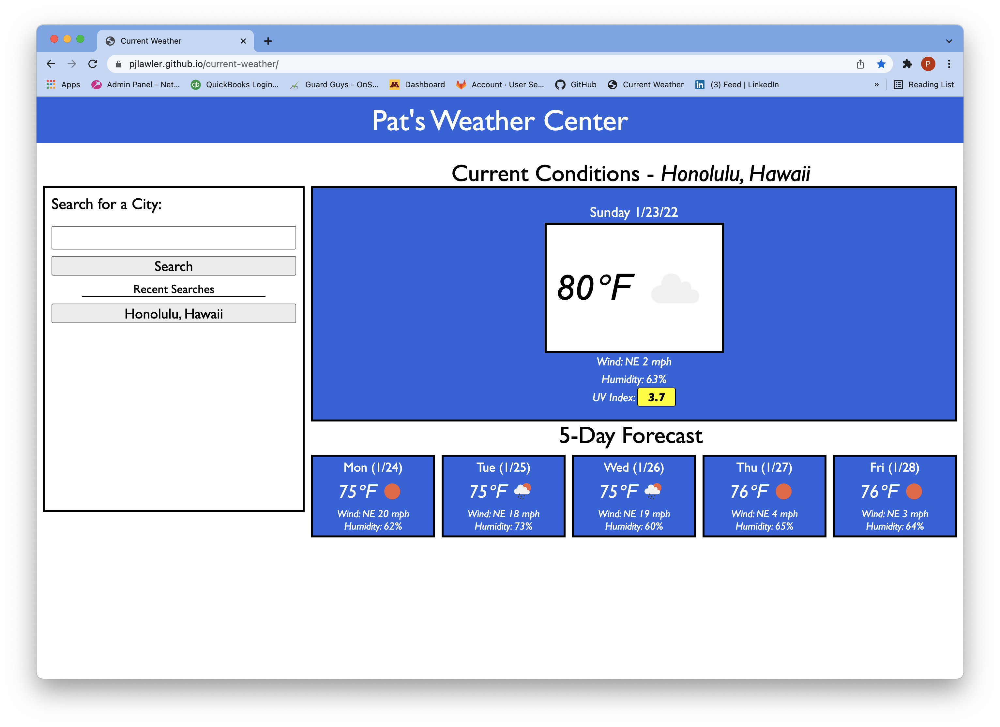

# Pat's Weather Center
## Your on-call stop to find the current weather and forecast for your favorite spot

### Locations
GitHub location:    https://github.com/pjlawler/weather-center

Deployed Live to:    https://pjlawler.github.io/weather-center/

### Features
- Provides up-to-date weather conditions and 5-day forecast for all locations
- Gives color code indication on the UV Index (Green, Yellow, or Red)
- Persistently stores recent searches in memory and on quick-buttons for easy refreshing
- adapts for different devices

### Technologies used:
- HTML5/CSS3/JS
- Local API (including localStorage, DOM)
- 3rd Party API (Moment.js)
- RESTful Server-Side APIs (One-Call for WX Data & OpenCage Data for GEOLocating City Name => Lat/Long)

### License Info
Copyright (c) 2022 Lawler Innovations, Inc.

Permission is hereby granted, free of charge, to any person obtaining a copy of this software and associated documentation files (the "Software"), to deal in the Software without restriction, including without limitation the rights to use, copy, modify, merge, publish, distribute, sublicense, and/or sell copies of the Software, and to permit persons to whom the Software is furnished to do so, subject to the following conditions:

The above copyright notice and this permission notice shall be included in all copies or substantial portions of the Software.

THE SOFTWARE IS PROVIDED "AS IS", WITHOUT WARRANTY OF ANY KIND, EXPRESS OR IMPLIED, INCLUDING BUT NOT LIMITED TO THE WARRANTIES OF MERCHANTABILITY, FITNESS FOR A PARTICULAR PURPOSE AND NONINFRINGEMENT. IN NO EVENT SHALL THE AUTHORS OR COPYRIGHT HOLDERS BE LIABLE FOR ANY CLAIM, DAMAGES OR OTHER LIABILITY, WHETHER IN AN ACTION OF CONTRACT, TORT OR OTHERWISE, ARISING FROM, OUT OF OR IN CONNECTION WITH THE SOFTWARE OR THE USE OR OTHER DEALINGS IN THE SOFTWARE.